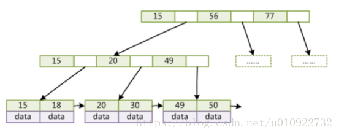
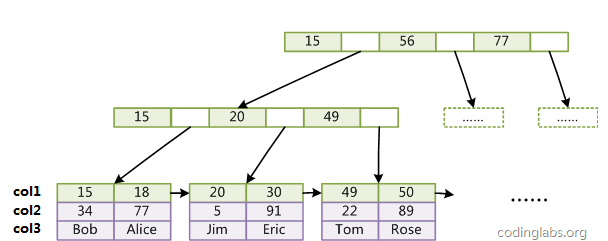
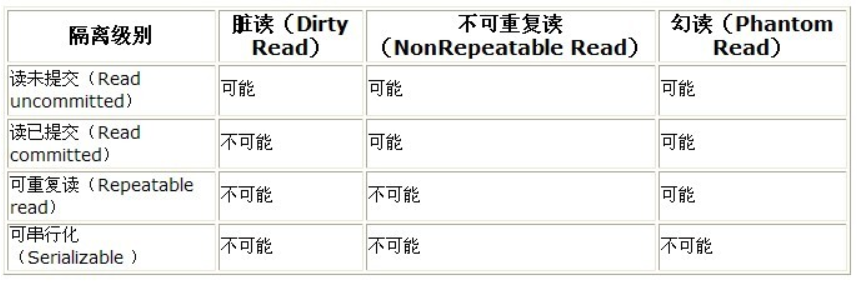
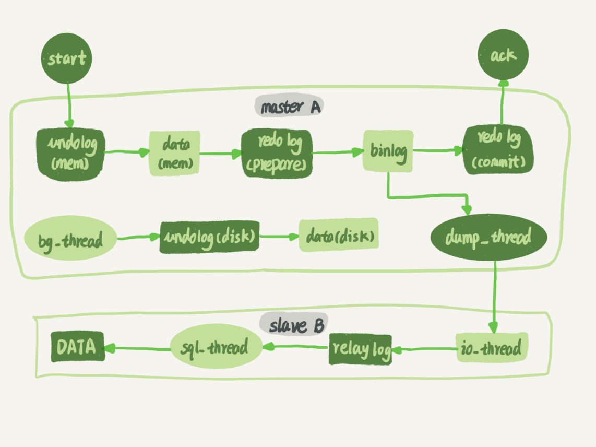
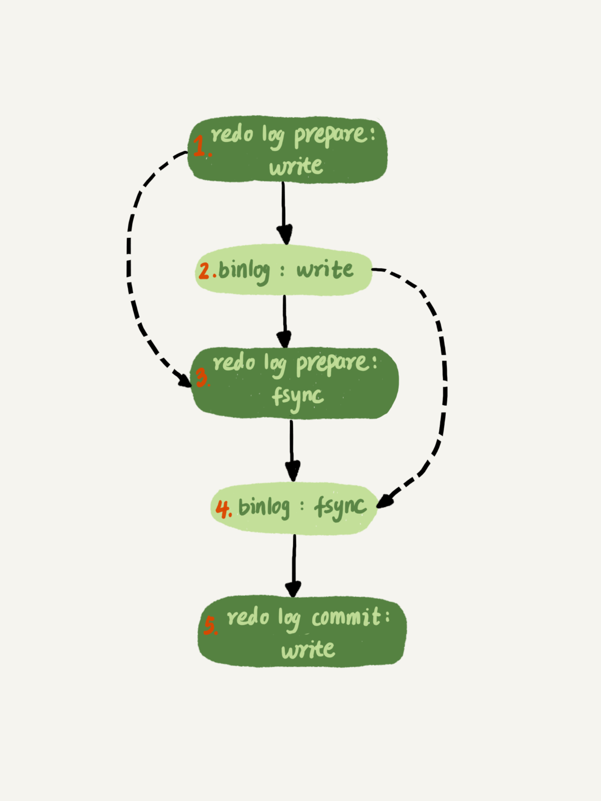
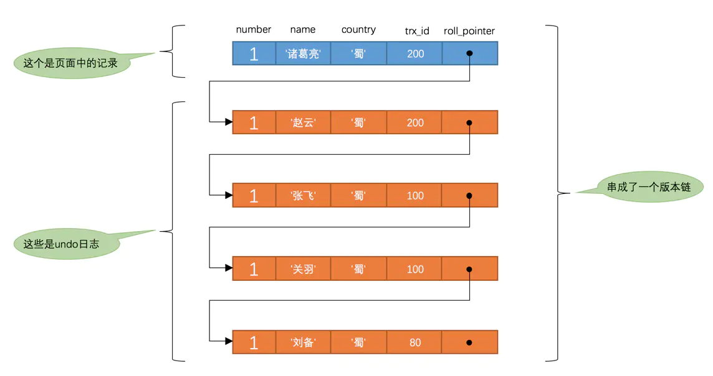

# InnoDB数据页结构

它是`InnoDB`管理存储空间的基本单位，一个页的大小一般是`16KB`

1. InnoDB为了不同的目的而设计了不同类型的页，我们把用于存放记录的页叫做`数据页`。
2. 一个数据页可以被大致划分为7个部分，分别是
   - `File Header`，表示页的一些通用信息，占固定的38字节。
   - `Page Header`，表示数据页专有的一些信息，占固定的56个字节。
   - `Infimum + Supremum`，两个虚拟的伪记录，分别表示页中的最小和最大记录，占固定的`26`个字节。
   - `User Records`：真实存储我们插入的记录的部分，大小不固定。
   - `Free Space`：页中尚未使用的部分，大小不确定。
   - `Page Directory`：页中的某些记录相对位置，也就是各个槽在页面中的地址偏移量，大小不固定，插入的记录越多，这个部分占用的空间越多。
   - `File Trailer`：用于检验页是否完整的部分，占用固定的8个字节。
3. 每个记录的头信息中都有一个`next_record`属性，从而使页中的所有记录串联成一个`单链表`。
4. `InnoDB`会把页中的记录划分为若干个组，每个组的最后一个记录的地址偏移量作为一个`槽`，存放在`Page Directory`中，所以在一个页中根据主键查找记录是非常快的，分为两步：
   - 通过二分法确定该记录所在的槽。
   - 通过记录的next_record属性遍历该槽所在的组中的各个记录。
5. 每个数据页的`File Header`部分都有上一个和下一个页的编号，所以所有的数据页会组成一个`双链表`。
6. mysql页文件默认16K


# B+Tree

- 非叶子节点不存储data，只存储索引(冗余)，可以放更多的索引

- 叶子节点包含所有索引字段

- 叶子节点用指针连接，提高区间访问的性能




- 推荐使用整型的自增主键
  - 主键能保证这行数据是唯一的，如果表没有减主键，会默认建立了唯一索引的作为主键，如果没有唯一索引列，mysql会自动为你建一个唯一列，mysql自己维护（对用户不可见）
  - 整型比较节省空间
  - 跟B+树加载页文件有关，自增主键能狗保证每条新建数据都是自增，那么每条数据都是加到每页的最后面，避免页分裂操作。如果不是自增，插到页文件中间，那么如果页大小满了，需要进行页分裂。


组合索引结构




# 覆盖索引

mysql执行计划explain结果里的key有使用索引，如果select后面查询的字段都可以从这个索引的树中获取，这种情况一般可以说是用到了覆盖索引，extra里一般都有using index；覆盖索引一般针对的是辅助索引，整个查询结果只通过辅助索引就能拿到结果，不需要通过辅助索引树找到主键，再通过主键去主键索引树里获取其它字段值  


# 索引实践

全值匹配

最左前缀法则

不在索引列上做任何操作

存储引擎不能使用索引中范围条件右边的列(一般范围查询的列放在最后)

尽量使用覆盖索引

减少使用不等于

字符串不加单引号索引失效

少用or或in


# 索引设计原则

1、代码先行，索引后上

2、联合索引尽量覆盖条件

3、不要在小基数字段上建立索引

4、长字符串我们可以采用前缀索引
对这个字段里的每个值的前20个字符放在索引树里，类似于 KEY index(name(20),age,position)。

5. 优先对访问频繁的业务进行优化

6、基于慢sql查询做优化


# Explain分析


id:选择标识符
select_type:表示查询的类型。
table:输出结果集的表
partitions:匹配的分区
type:表示表的连接类型
possible_keys:表示查询时，可能使用的索引
key:表示实际使用的索引
key_len:索引字段的长度
ref:列与索引的比较
rows:扫描出的行数(估算的行数)
filtered:按表条件过滤的行百分比
Extra:执行情况的描述和说明


**type**

对表访问方式，表示MySQL在表中找到所需行的方式，又称“访问类型”。

常用的类型有： **system > const > eq_ref > ref > range > index > ALL**  （最优到最差）

一般来说，**得保证查询达到range级别，最好达到ref**  

ALL：Full Table Scan， MySQL将遍历全表以找到匹配的行

index: Full Index Scan，index与ALL区别为index类型只遍历索引树

range:只检索给定范围的行，使用一个索引来选择行

ref: 表示上述表的连接匹配条件，即哪些列或常量被用于查找索引列上的值

eq_ref: 类似ref，区别就在使用的索引是唯一索引，对于每个索引键值，表中只有一条记录匹配，简单来说，就是多表连接中使用primary key或者 unique key作为关联条件

const、system: 当MySQL对查询某部分进行优化，并转换为一个常量时，使用这些类型访问。如将主键置于where列表中，MySQL就能将该查询转换为一个常量，system是const类型的特例，当查询的表只有一行的情况下，使用system

NULL: MySQL在优化过程中分解语句，执行时甚至不用访问表或索引，例如从一个索引列里选取最小值可以通过单独索引查找完成。


# Join关联查询原理

## 嵌套循环连接 Nested-Loop Join(NLJ) 算法（被驱/驱动表一行行读）

```mysql
EXPLAIN select * from t1 inner join t2 on t1.a= t2.a;
```

一次一行循环地从第一张表（称为**驱动表**）中读取行，在这行数据中取到关联字段，根据关联字段在另一张表（**被驱动表**）里取出满足条件的行，然后取出两张表的结果合集。

1. 从表 t2 中读取一行数据（如果t2表有查询过滤条件的，用先用条件过滤完，再从过滤结果里取出一行数据）；
2. 从第 1 步的数据中，取出关联字段 a，到表 t1 中查找；
3. 取出表 t1 中满足条件的行，跟 t2 中获取到的结果合并，作为结果返回给客户端；
4. 重复上面 3 步。

## 基于块的嵌套循环连接 Block Nested-Loop Join(BNL)算法（被驱/驱动表一块块, 这样设计导致不会使用索引）


```mysql
EXPLAIN select * from t1 inner join t2 on t1.a= t2.a;
```


把驱动表的数据读入到 join_buffer 中，然后扫描被驱动表，把被驱动表每一行取出来跟 join_buffer 中的数据做对比。

1. 把 t2 的所有数据放入到 join_buffer 中
2. 把表 t1 中每一行取出来，跟 join_buffer 中的数据做对比
3. 返回满足 join 条件的数据

## mysql 对NLJ 和BNL的选择

被驱动表的关联字段没索引选择使用 BNL 算法而不使用 Nested-Loop Join


# 事务隔离级别



默认RR


- 更新丢失(Lost Update)或脏写
  - 当两个或多个事务选择同一行，然后基于最初选定的值更新该行时，由于每个事务都不知道其他事务的存在，就会发生丢失更新问题–**最后的更新覆盖了由其他事务所做的更新**。
- 脏读 - 事务A读取到了事务B已经修改但尚未提交的数据
- 不可重读 - 事务A内部的相同查询语句在不同时刻读出的结果不一致，不符合隔离性
- 幻读  - 事务A读取到了事务B提交的新增数据，不符合隔离性


# mysql锁

行锁 - 锁定粒度最小，发生锁冲突的概率最低，并发度最高。

间隙锁，锁的就是两个值之间的空隙。

Next-Key Locks是行锁与间隙锁的组合。


# MVCC多版本并发控制机制


WAL机制(Write Ahead Log)

WAL指的是对数据文件进行修改前，必须将修改先记录日志。MySQL为了保证ACID中的一致性和持久性



1. 读磁盘idb文件进缓存  -> 2. 写undo log -> 3. 更新缓存 -> 4.二阶提交redo log, bin log -> 写入磁盘


- undo log
  - 读数据时数据版本计算，可以通过undo log和当前版本的数据，计算出旧版本的数据
  - 如果数据库崩溃了，但是redo log还没有commit，需要通过undo log 回归还原数据
- redo log - crash-safe(崩溃恢复)
- bin log - 主备复制


# 二阶提交





- 阶段1：InnoDB redo log 写盘，InnoDB 事务进入 prepare 状态

- 阶段2：如果前面prepare成功，binlog 写盘，那么再继续将事务日志持久化到binlog，如果持久化成功，那么InnoDB事务 则进入 commit 状态(实际是在redo log里面写上一个commit记录)

每个事务binlog的末尾，会记录一个 XID event，标志着事务是否提交成功，也就是说，recovery 过程中，binlog最后一个 XID event 之后的内容都应该被 purge。

为何需要二阶提交

- 反证1：对于 InnoDB 引擎来说，如果 redo log 提交完成了，事务就不能回滚（如果这还允许回滚，就可能覆盖掉别的事务的更新）。而如果 redo log 直接提交，然后 binlog 写入的时候失败，InnoDB 又回滚不了，数据和 binlog 日志又不一致了。
- 反证2：先写 redo log 后写 binlog。假设在 redo log 写完，binlog 还没有写完的时候，MySQL 进程异常重启。由于我们前面说过的，redo log 写完之后，系统即使崩溃，仍然能够把数据恢复回来，所以恢复后这一行 c 的值是 1。但是由于 binlog 没写完就 crash 了，这时候 binlog 里面就没有记录这个语句。因此，之后备份日志的时候，存起来的 binlog 里面就没有这条语句。然后你会发现，如果需要用这个 binlog 来恢复临时库的话，由于这个语句的 binlog 丢失，这个临时库就会少了这一次更新，恢复出来的这一行 c 的值就是 0，与原库的值不同。
- binlog 没有能力恢复“数据页”。如果组提交的tx1,tx2,但是tx2回滚了，那么tx1无法恢复


# 组提交

组提交是顺序写，能加快数据落盘速度和主从同步速度

redo log 和 binlog 都是顺序写，磁盘的顺序写比随机写速度要快

组提交机制，可以大幅度降低磁盘的 IOPS 消耗。

更新 binlog、redolog、undolog 都是在做顺序 IO，而更新 datafile 和索引文件则是在做随机 IO


三个并发事务 (trx1, trx2, trx3) 在 prepare 阶段，都写完 redo log buffer，持久化到磁盘的过程，对应的 LSN 分别是 50、120 和 160。

1.trx1 是第一个到达的，会被选为这组的 leader；
2.等 trx1 要开始写盘的时候，这个组里面已经有了三个事务，这时候 LSN 也变成了 160；
3.trx1 去写盘的时候，带的就是 LSN=160，因此等 trx1 返回时，所有 LSN 小于等于 160 的 redo log，都已经被持久化到磁盘；
4.这时候 trx2 和 trx3 就可以直接返回了。

一次组提交里面，组员越多，节约磁盘 IOPS 的效果越好。但如果只有单线程压测，那就只能老老实实地一个事务对应一次持久化操作了。


# 事务隔离的实现

一致性视图



说明

- `m_ids`：表示在生成`ReadView`时当前系统中活跃的读写事务的`事务id`列表。
- `min_trx_id`：表示在生成`ReadView`时当前系统中活跃的读写事务中最小的`事务id`，也就是`m_ids`中的最小值。
- `max_trx_id`：表示生成`ReadView`时系统中应该分配给下一个事务的`id`值。
- `creator_trx_id`：表示生成该`ReadView`的事务的`事务id`。

> max_trx_id并不是m_ids中的最大值，事务id是递增分配的。比方说现在有id为1，2，3这三个事务，之后id为3的事务提交了。那么一个新的读事务在生成ReadView时，m_ids就包括1和2，min_trx_id的值就是1，max_trx_id的值就是4。
>
> 执行INSERT、DELETE、UPDATE这些语句时才会为事务分配事务id，否则在一个只读事务中的事务id值都默认为0。

规则

- 如果被访问版本的`trx_id`属性值与`ReadView`中的`creator_trx_id`值相同，意味着当前事务在访问它自己修改过的记录，所以该版本可以被当前事务访问。
- 如果被访问版本的`trx_id`属性值小于`ReadView`中的`min_trx_id`值，表明生成该版本的事务在当前事务生成`ReadView`前已经提交，所以该版本可以被当前事务访问。
- 如果被访问版本的`trx_id`属性值大于或等于`ReadView`中的`max_trx_id`值，表明生成该版本的事务在当前事务生成`ReadView`后才开启，所以该版本不可以被当前事务访问。
- 如果被访问版本的`trx_id`属性值在`ReadView`的`min_trx_id`和`max_trx_id`之间，那就需要判断一下`trx_id`属性值是不是在`m_ids`列表中，如果在，说明创建`ReadView`时生成该版本的事务还是活跃的，该版本不可以被访问；如果不在，说明创建`ReadView`时生成该版本的事务已经被提交，该版本可以被访问。

> READ COMMITTED —— 每次读取数据前都生成一个ReadView
>
> REPEATABLE READ —— 在第一次读取数据时生成一个ReadView


